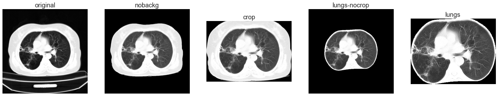
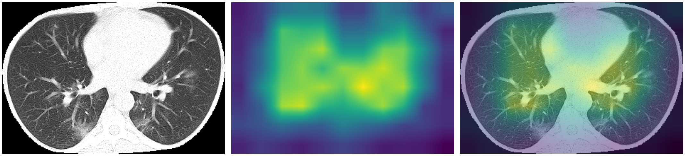

# COV19 Detection on CT Scans

The project aims to analyze computed tomography (CT) images and classify them into one of three classes: COV, Normal, OtherPneumonia. The dataset is publicly available under [this link](https://github.com/m2dgithub/CT-COV19) (data version used in the project: [link](https://github.com/m2dgithub/CT-COV19/tree/598e9b8e86cb8e54179a130c3d990ee97fde5353)).

The project consists of Jupyter notebooks and additional py files with model architectures and some useful functions.

## Initial analysis and preprocessing

The analysis of the dataset and other visualisations can be found in:

* [Analysis and Visualisations](notebooks/Analysis-Visualisations.ipynb) - analysis of the dataset
* [Data Augmentation](notebooks/Data-Augmentation.ipynb) - images after data augmentation

Preprocessing steps are presented in:

* [Patient Segmentation](notebooks/Background-Removal.ipynb) - finding patient's contour and background removal

* [Lungs Segmentation](notebooks/Skimage-Lungs-Segmentation.ipynb) - lungs segmentation using skimage segmentation

## Model configurations

Several model architectures have been used:
* Simple model created from scratch,
* Tiny, Small, LargeW, LargeT architectures from [Transfusion: Understanding Transfer Learning for Medical Imaging](https://arxiv.org/abs/1902.07208),
* ResNet-50 from [Google Big Transfer](https://tfhub.dev/google/bit/s-r50x1/1),
* EfficientNet B0, B3, B7.

Models were trained on images at different stages of processing:

The influence of class weight (*classw*) and data augmentation (*dataaug*) were examined. The lack of these methods is referred to as *baseline*.

## Results

The highest f1 scores achieved on the validation set:

| Model | Configuration | F1 Score | AUC |
|  :-:  |      :-:      |    :-:   | :-: |
| Simple | original-classw-dataaug | 0.810 | 0.925 |
| Tiny | original-baseline | 0.861 | 0.954 |
| Small | original-baseline | 0.860 | 0.944 |
| LargeW | original-classw | 0.853 | 0.944 |
| LargeT | orginal-baseline | 0.888 | 0.958 |
| ResNet-50 | original-baseline | 0.766 | 0.893 |
| EfficientNet B3 - weights ImageNet | lungs-baseline | 0.768 | 0.896 |
| EfficientNet B3 - weights None | lungs-nocrop-baseline | 0.761 | 0.866 |

Scores achieved on the testset by the above best models:

| Model | Configuration | F1 Score | AUC |
|  :-:  |      :-:      |    :-:   | :-: |
| Simple | original-classw-dataaug | 0.582 | 0.810 |
| Tiny | original-baseline | 0.580 | 0.811 |
| Small | original-baseline | 0.600 | 0.798 |
| LargeW | original-classw | 0.634 | 0.792 |
| LargeT | orginal-baseline | 0.577 | 0.796 |
| ResNet-50 | original-baseline | 0.711 | 0.886 |
| EfficientNet B3 - weights ImageNet | lungs-baseline | 0.629 | 0.845 |
| EfficientNet B3 - weights None | lungs-nocrop-baseline | 0.570 | 0.760 |

Metrics and results plots are spread over several notebooks:

* [F1 Scores](notebooks/F1-Scores.ipynb) - f1 scores achieved by models on validation set
* [Confusion Matrices](notebooks/Confusion-Matrices.ipynb) - confusion matrices for each model configuration
* [AUC Scores](notebooks/AUC-Scores.ipynb) - AUC scores for all models configurations along with ROC and Precision-Recall curves for the best models

Explainability of the solution is taken up here:

* [GradCAM](notebooks/GradCAM.ipynb) - GradCAM analysis

## Disclaimer

This project is intended for educational purposes only. It is not a substitute for professional medical advice, diagnosis or treatment. 
