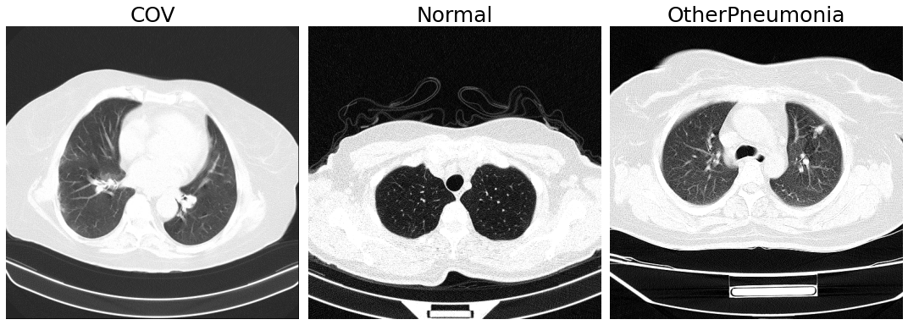

# COV19 Detection on CT Scans

The project aims to analyze computed tomography (CT) images and classify them into one of three classes: COV, Normal, OtherPneumonia. The dataset is publicly available under [this link](https://github.com/m2dgithub/CT-COV19).

The project consists of Jupyter notebooks and additional py files with model architectures and some useful functions.

## Initial analysis and preprocessing

The analysis of the dataset and other visualisations can be found in:

* [Analysis and Visualisations](notebooks/Analysis-Visualisations.ipynb) - analysis of the dataset
* [Data Augmentation](notebooks/Data-Augmentation.ipynb) - images after data augmentation

Preprocessing steps are presented in:

* [Patient Segmentation](notebooks/Background-Removal.ipynb) - finding patient's contour and background removal

* [Lungs Segmentation](notebooks/Skimage-Lungs-Segmentation.ipynb) - lungs segmentation using skimage segmentation

## Results

<>

## Disclaimer

This project is intended for educational purposes only. It is not a substitute for professional medical advice, diagnosis or treatment. 
